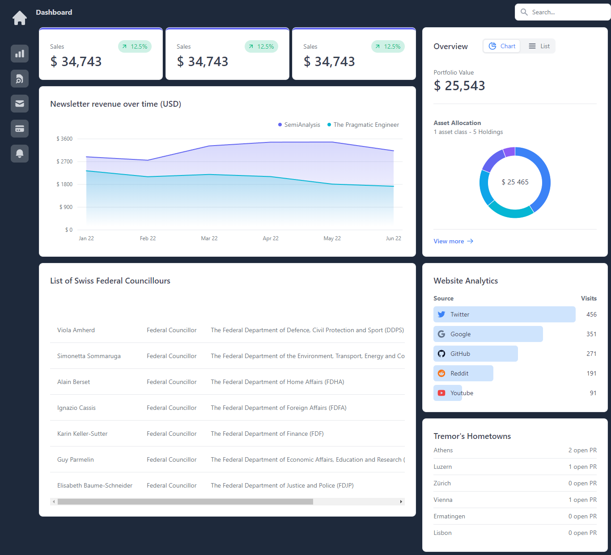

# Dashboard Financeiro em React.js




## Descrição do Projeto

Este projeto consiste em um Dashboard Financeiro desenvolvido em React.js, uma biblioteca JavaScript amplamente utilizada para a construção de interfaces de usuário. O objetivo principal do dashboard é fornecer uma visão clara e intuitiva das finanças, permitindo aos usuários acompanhar e analisar dados financeiros de maneira eficiente.

## Tecnologias Utilizadas

O projeto utiliza as seguintes tecnologias:

- **React.js**: Uma biblioteca JavaScript para construção de interfaces de usuário. React permite a criação de componentes reutilizáveis que tornam o desenvolvimento mais eficiente.

- **Vite**: Um framework para desenvolvimento de aplicações web extremamente rápido. Ele oferece um ambiente de desenvolvimento rápido, permitindo a criação de projetos React de forma mais eficiente.

- **Tailwind CSS**: Um framework de utilitários CSS altamente configurável. Ele facilita a estilização do projeto de forma rápida e consistente.

- **Tremor lib**: Uma biblioteca que pode ser utilizada para a visualização de dados. No contexto do dashboard financeiro, Tremor lib pode ser empregado para criar gráficos e representações visuais dos dados financeiros.

## Como Rodar o Projeto

Para executar o projeto, siga os passos abaixo:

1. **Acesso ao Projeto:**
   - Acesse o link: [Dashboard Financeiro](https://erickolk.github.io/Dashboard-responsive/)

2. **Requisitos:**
   - Certifique-se de ter o [Node.js](https://nodejs.org/) instalado em sua máquina.

3. **Clone o Repositório:**
   ```bash
   git clone https://github.com/erickolk/Dashboard-responsive.git
